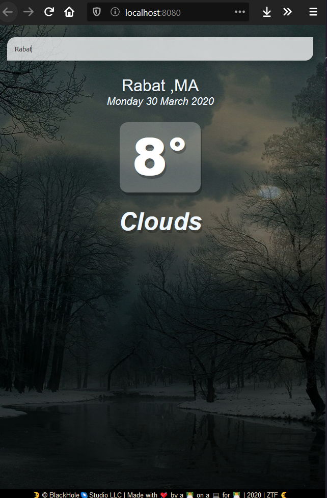

# weather-vuejs

A simple app made while practicing my VueJs skills and based on the Tyler Potts tutorial on youtube .



## Project setup

```
pnpm install
```

### Edit App.vue

```
Edit the section where it says api_key with yours from openweather api
```


### Compiles and hot-reloads for development

```
pnpm run serve
```

### Compiles and minifies for production

```
pnpm run build
```
